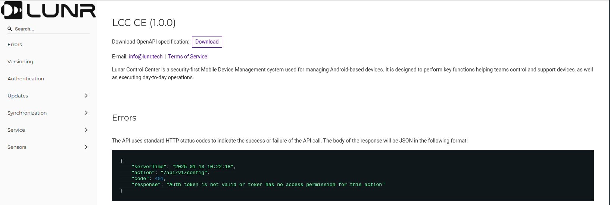

# API Documentation

The documentation includes detailed information on various API endpoints. Each endpoint is accompanied by example requests and responses, along with descriptions of parameters and expected data formats.

Designed to support developers in integrating LCC CE into their applications, the portal offers insights into authentication methods, data structures, and usage scenarios.

OpenAPI specification for the LCC is in [lcc-ce.yaml](../openapi/lcc-ce.yaml) file. Please use Swagger UI or Redoc to view the API documentation.

---
Next: [Mqtt Communication Map](./Mqtt%20Communication%20Map.md)